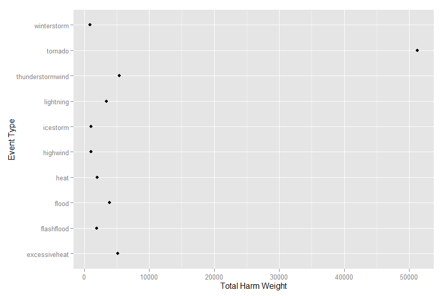

# NOAA Storm Database Analysis
Gran Ville Lintao  
August 22, 2015  

## Synopsis
In this study we aim to gain understanding on what types of events throughout the US history are the most harmful to population health and most damaging to the US economy. To investigate this we obtained the Storm Data from the National Weather Service. This contains data from the year 1950 up to 2011, but we only analyze more clean and reliable data starting from 1995 up to 2011. From the results of cleaning, summarizing and analyzing the data we found out that "Tornado" events are the most harmful to population health resulting to more than 50,000 counts of combined fatalities and injuries. Meanwhile, "ThunderStormWinds" are the most economically damaging resulting to 2 Billion USD in damages from 1995 to 2011 in the US.

<!-- Libraries and Options -->


## Data Processing

The Storm Data for this study is downloaded from
[here](https://d396qusza40orc.cloudfront.net/repdata%2Fdata%2FStormData.csv.bz2)

Additional documentation about this database is available from the following links:

[National Weather Service Storm Data Documentation]
(https://d396qusza40orc.cloudfront.net/repdata%2Fpeer2_doc%2Fpd01016005curr.pdf)

[National Climatic Data Center Storm Events FAQ]
(https://d396qusza40orc.cloudfront.net/repdata%2Fpeer2_doc%2FNCDC%20Storm%20Events-FAQ%20Page.pdf)

In the following code, we aim to load the csv file and convert it to plyr structures for easier processing:


```r
fileName <- "repdata-data-StormData.csv.bz2"
dataRead <- read.csv(fileName, stringsAsFactors=FALSE)
dataAsDF <- tbl_df(dataRead)
```

## Analysis of type of events which are most harfmul with respect to population health

### Data Processing - Tidying the data

In the following code we subset the original data and include only those events that has fatalities and injuries

```r
# subset for analysis
dataHarm <- subset(dataAsDF, !(FATALITIES==0 & INJURIES==0))
```

And then since the EVTYPE variable is messy and uses inconsistent naming, we shall clean it by making it consistent and correcting spelling mistakes

```r
# clean EVTYPE variable for more accurate analysis

# tolower
dataHarm$EVTYPE <- tolower(dataHarm$EVTYPE)
# remove space
dataHarm$EVTYPE <- gsub(" ", "", dataHarm$EVTYPE)
# remove s in the end
dataHarm$EVTYPE <- sub("s$", "", dataHarm$EVTYPE)
# remove "ing"s
dataHarm$EVTYPE <- sub("ing$", "", dataHarm$EVTYPE)
# correct wrong spellings
dataHarm$EVTYPE <- sub("avalance", "avalanche", dataHarm$EVTYPE)
dataHarm$EVTYPE <- sub("flashflooding", "flashflood", dataHarm$EVTYPE)
dataHarm$EVTYPE <- sub("lightn$", "lightning", dataHarm$EVTYPE)
dataHarm$EVTYPE <- sub("tstmwind$|thunderstormswind$|thunderstormwin$|thundertormwind$|thunderstormw$|thunderstormwinds$", "thunderstormwind", dataHarm$EVTYPE)
dataHarm$EVTYPE <- sub("urbanandsmallstreamfloodin$", "urban/smlstreamfld", dataHarm$EVTYPE)
dataHarm$EVTYPE <- sub("waterspouttornado$", "waterspout/tornado", dataHarm$EVTYPE)
dataHarm$EVTYPE <- sub(" wild/forestfire$", "wildfire", dataHarm$EVTYPE)
dataHarm$EVTYPE <- sub("winterweather/mix$|winterweathermix$|wintrymix$", "winterweather", dataHarm$EVTYPE)
```

### Data Processing - Calculating the Total Harm Effect

Now that the data is clean - we devise a strategy for calculating the total effect of fatalities and injuries. 
We do this by counting 1 fatality as 1 total effect and 2 injuries as 1 total effect - we do this calculation since in economic terms 1 injury doesn't seem to equate with 1 fatality.

```r
# process for analysis
dataHarm <- mutate(dataHarm, TOTALHARMWEIGHT=FATALITIES + (INJURIES/2))
dataHarm <- arrange(dataHarm, desc(TOTALHARMWEIGHT))
```

### Results - Summary

In the next code, we summarize the Total Harm Weight by summing it across all the event types

```r
# summarize TOTALHARMWEIGHT per EVTYPE 
byEvtType <- group_by(dataHarm, EVTYPE)
summaryByEvtType <- summarize(byEvtType, TOTALHARMWEIGHT=sum(TOTALHARMWEIGHT))
summaryByEvtType <- arrange(summaryByEvtType, desc(TOTALHARMWEIGHT))
```

### Results - Data Visualization
And then we pick out the top 10 events and finally show a plot for a quick visualization

```r
summaryByEvtTypeTop <- summaryByEvtType[1:10,]
qplot(TOTALHARMWEIGHT, EVTYPE, data=summaryByEvtTypeTop, xlab="Total Harm Weight", ylab="Event Type")
```

 

As we can see above, Tornado events are the most harmful to population health and it dwarfs the other events by Total Harm Weight. Next on the list is ThunderStormWind and ExcessiveHeat, followed by Flood and Lightning, then FlashFlood and Heat. The rest are mostly with the same values.

## Analysis of type of events which have the greatest economic consequences

### Data Processing - Subsetting recent date
In this code we transform the date to R Posix types and use it so that we only analyze more recent data because this data are much more reliable and data gathered on these dates are a lot more consistent.


```r
dataEco <- dataAsDF
dataEco$BGN_DATE2 <- strptime(dataEco$BGN_DATE, format="%m/%d/%Y")
# analyse only recent times - from 1995 to 2011
dataEco <- subset(dataEco, BGN_DATE2 >= as.POSIXct("01/01/1996", format="%m/%d/%Y"))
```

### Data Processing - Tidying the EVTYPE
Next we clean the resulting data for a much tidier analysis

```r
# clean EVTYPE variable for more accurate analysis
# tolower
dataEco$EVTYPE <- tolower(dataEco$EVTYPE)
# remove space
dataEco$EVTYPE <- gsub(" ", "", dataEco$EVTYPE)
# remove s in the end
dataEco$EVTYPE <- sub("s$", "", dataEco$EVTYPE)
# remove "ing"s
dataEco$EVTYPE <- sub("ing$", "", dataEco$EVTYPE)
# correct wrong spellings
dataEco$EVTYPE <- sub("avalance", "avalanche", dataEco$EVTYPE)
dataEco$EVTYPE <- sub("flashflooding", "flashflood", dataEco$EVTYPE)
dataEco$EVTYPE <- sub("lightn$", "lightning", dataEco$EVTYPE)
dataEco$EVTYPE <- sub("tstmwind$|thunderstormswind$|thunderstormwin$|thundertormwind$|thunderstormw$|thunderstormwinds$", "thunderstormwind", dataEco$EVTYPE)
dataEco$EVTYPE <- sub("urbanandsmallstreamfloodin$", "urban/smlstreamfld", dataEco$EVTYPE)
dataEco$EVTYPE <- sub("waterspouttornado$", "waterspout/tornado", dataEco$EVTYPE)
dataEco$EVTYPE <- sub(" wild/forestfire$", "wildfire", dataEco$EVTYPE)
dataEco$EVTYPE <- sub("winterweather/mix$|winterweathermix$|wintrymix$", "winterweather", dataEco$EVTYPE)
```

### Data Processing - Total Economic Damage
In this subsection we devise a simple strategy for calculating the total economic damage - which after further investigation of the dataset, we can get it from two variables namely PROPDMGEXP or "Property Damage Exponent" and CROPDMGEXP or "Crop Damage Exponent". 

Thus, we then tidy the Property Damage Exponent and the Crop Damage Exponent.
Then we create another column which we use to multiply with the Property Damage Cost and the Crop Damage Cost.
Finally we sum both costs to create the TOTALECODMG or "Total Economic Damage"


```r
dataEco$PROPDMGEXP <- tolower(dataEco$PROPDMGEXP)
dataEco$CROPDMGEXP <- tolower(dataEco$CROPDMGEXP)

letterToMultiplier <- function(letter) 
{
  if (letter == "b") {
    return (as.double(12));
  }
  else if (letter == "m") {
    return (as.double(9));
  }
  else if (letter == "k") {
    return (as.double(3));
  }
  else if (letter == "h") {
    return (as.double(2));
  }
  else {
    return (as.double(0));
  }
}

dataEco <- mutate(dataEco, PROPDMGEXP2=letterToMultiplier(PROPDMGEXP))
dataEco <- mutate(dataEco, CROPDMGEXP2=letterToMultiplier(CROPDMGEXP))
dataEco <- mutate(dataEco, TOTALECODMG = (PROPDMG * (10 ^ PROPDMGEXP2)) + (CROPDMG * (10^CROPDMGEXP2)))
```

### Results - Summary
Next we then summarize the Total Economic Damage by Event Type then arrange them from top to bottom.

```r
dataEcoNew <- dataEco
dataEcoNew$BGN_DATE2 <- NULL
dataEcoNew2 <- group_by(dataEcoNew, EVTYPE)
sumDataEco <- summarize(dataEcoNew2, TOTALECODMG=sum(TOTALECODMG))
sumDataEco <- arrange(sumDataEco, desc(TOTALECODMG))
```

### Results - Data Visualization
Picking out the top 10 and plotting the data with the Event Type vs Total Economic Damage, we can clearly see that throughout the US history - the ThunderStormWind leads the damage by 2 Billion USD, followed by FlashFlood, then Tornado. Next is Hail, then Floods. The rest seems to cost around and less than 500 Million USD.


```r
sumDataEcoFinal <- sumDataEco[1:10,]
qplot(TOTALECODMG, EVTYPE, data=sumDataEcoFinal, xlab="Total Economic Damage", ylab="Event Type")
```

 


